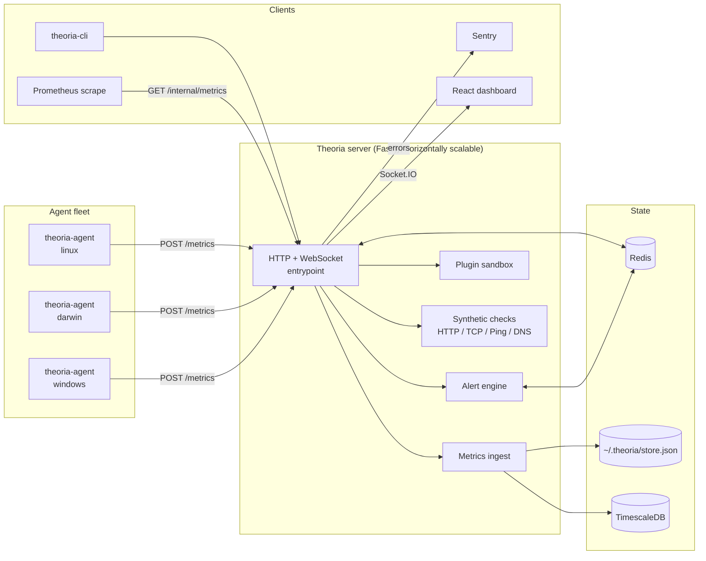

# Architecture

Theoria is a four-tier system: agents collect metrics and ship them to a
Fastify API, which broadcasts over Socket.IO to the React dashboard and
persists to TimescaleDB. Redis is optional but required for horizontal
scaling.

## Request lifecycle — `POST /metrics`

1. `@fastify/helmet` applies security headers.
2. Fastify generates (or accepts) a correlation ID in `x-request-id`.
3. `app.authenticateApiKey` validates the bearer token.
4. `metrics.controller` writes to the in-memory store **and** to
   TimescaleDB (if `DATABASE_URL`).
5. The alert engine evaluates rules synchronously against the new data;
   breach state is mirrored to Redis when available.
6. Socket.IO broadcasts `metrics:update` to every connected dashboard,
   via the Redis adapter if configured.
7. `/internal/metrics` counters are bumped for Prometheus to scrape.

## Single-node vs. HA

| Concern            | Single-node          | HA (multi-replica)            |
|--------------------|----------------------|-------------------------------|
| Storage            | JSON file            | TimescaleDB                   |
| Socket.IO fan-out  | in-memory            | `@socket.io/redis-adapter`    |
| Rate-limit         | local map            | Redis (shared counter)        |
| Account lockout    | local map            | Redis keys with TTL           |
| Alert breach state | local map            | Redis mirror + rehydrate      |

Enable HA by setting `DATABASE_URL` and `REDIS_URL` — no code changes
required.
